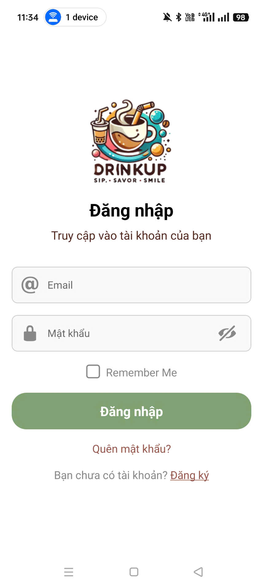
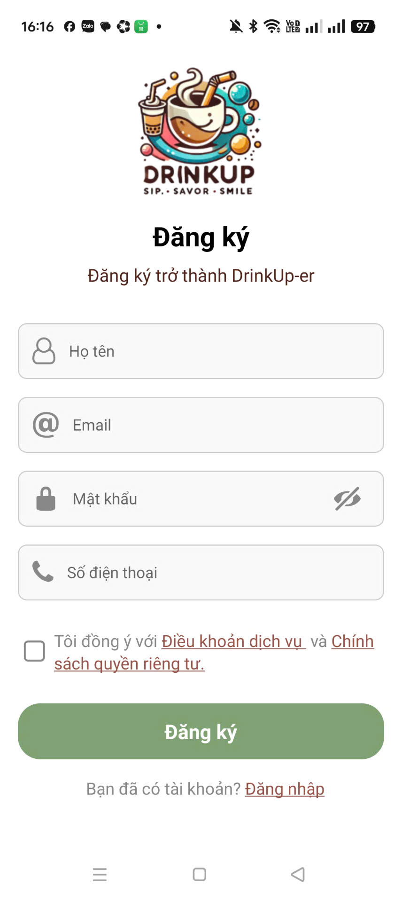
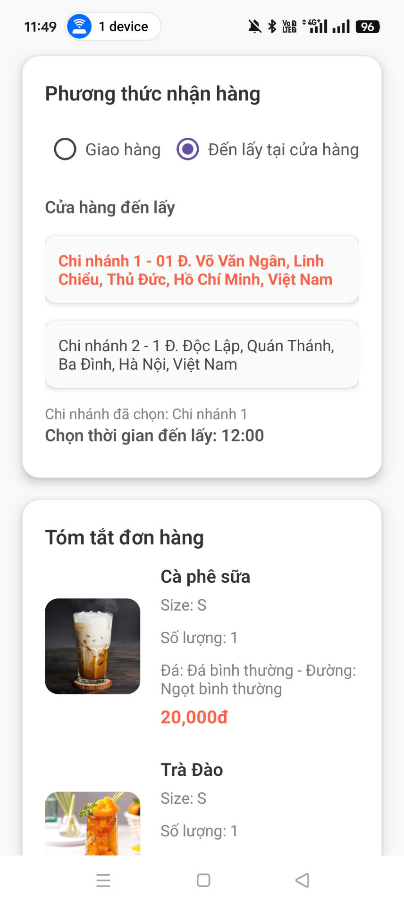
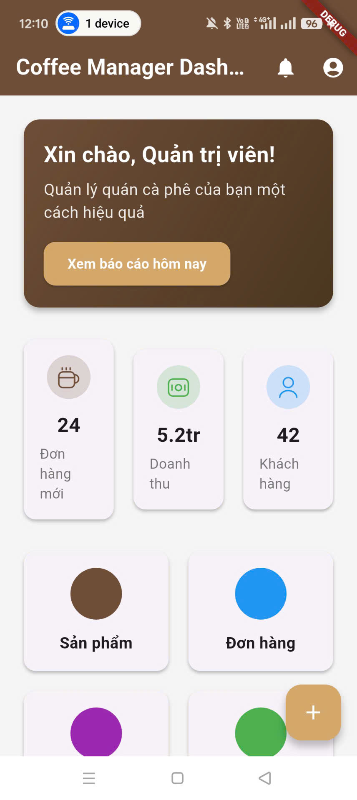

# 📱 DrinkUp - Ứng dụng đặt đồ uống


> *Ứng dụng di động giúp người dùng đặt đồ uống nhanh chóng, thanh toán tiện lợi và theo dõi đơn hàng một cách dễ dàng.*

---

## 📝 Giới thiệu

**DrinkUp** là một ứng dụng di động được phát triển nhằm giúp người dùng:
- Xem và đặt đồ uống trực tuyến
- Lựa chọn địa chỉ giao hàng để tính phí ship dựa trên khoảng cách
- Thanh toán trực tuyến qua VNPay
- Quản lý thông tin đơn hàng
- Quản trị hệ thống sản phẩm (dành cho Admin)

Dự án được thực hiện với mục tiêu học tập và áp dụng các công nghệ hiện đại như React Native, Node.js và MongoDB.

---

## ⚙️ Công nghệ sử dụng

- **Frontend (Mobile)**: React Native (Cho User) , Flutter (Cho Admin)
- **Backend**: Node.js, Express.js  
- **Cơ sở dữ liệu**: MongoDB  
- **Thanh toán**: VNPay API  

---

## 💡 Tính năng chính

- 🔍 Tìm kiếm và lọc danh sách đồ uống
- 🛍️ Thêm vào giỏ hàng và thanh toán qua VNPay
- 📍 Tính toán phí vận chuyển theo khoảng cách đến địa chỉ giao hàng
- 📦 Theo dõi đơn hàng
- 🧾 Quản lý sản phẩm, danh mục (Admin)
- 🔐 Xác thực người dùng và quản trị viên

---

## 📸 Giao diện ứng dụng

| Đăng nhập | Đăng ký | Giỏ hàng | Đặt hàng | Thanh toán | Admin
|----------|----------|----------|------------|--------|--------|
|  |  |  |  |  |  |

---

## 🚀 Hướng dẫn chạy dự án

### 1. Clone dự án:

```bash
git clone https://github.com/KoS9999/DrinkUp-MobileApp.git
cd DRINHUP_MOBILEAPP
```

### 2. Cài đặt và chạy Backend

```bash
cd .\Backend_DrinkUp\
npm install
npm run dev
```

### 3. Cài đặt và chạy Frontend (React Native)

```bash
cd .\Frontend_User_DrinkUp\
npm install
npx react-native run-android
# Hoặc nếu dùng iOS:
# npx react-native run-ios
```

### 3. Cài đặt và chạy Flutter

```bash
cd .\frontend_admin_drinkup\
flutter pub get
flutter run
```

## 📌 Ghi chú

- Dự án đang trong giai đoạn học tập và thử nghiệm, sẽ được tiếp tục hoàn thiện và tối ưu trong tương lai.
- Giao diện hiện tại đơn giản, nhưng đã hỗ trợ các chức năng chính: đăng nhập/đăng ký, giỏ hàng, thanh toán, quản lý đơn hàng, chọn địa chỉ tính phí ship và tích hợp ZaloPAY.

---

## 📄 Tác giả

**Nhóm sinh viên phát triển ứng dụng DRinkUp**  
Nguyễn Hoàng Phương Ngân
Ngô Ngọc Thông
